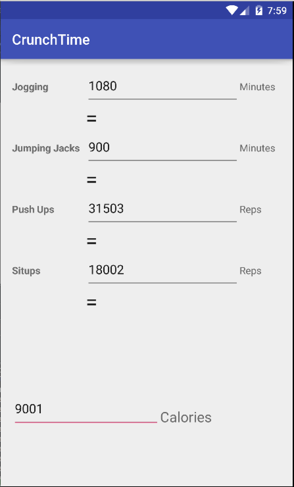
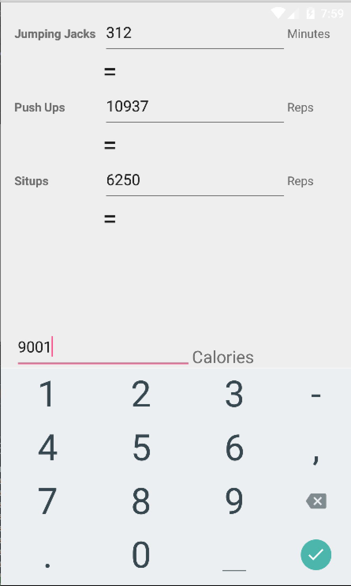
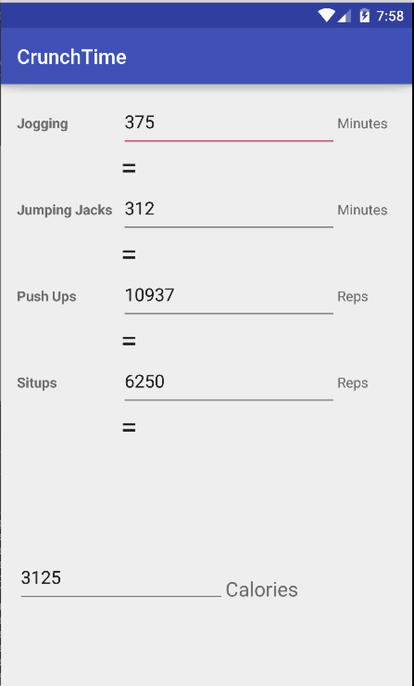
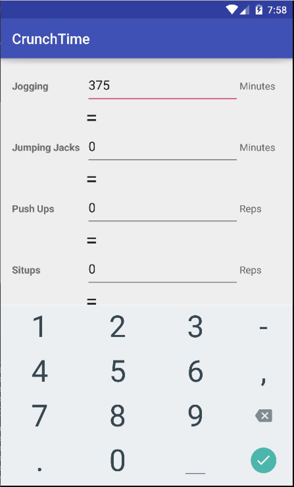
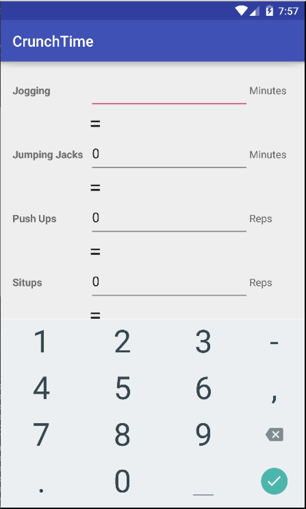

# PROG 01: Crunch Time

This is my basic Android calorie burning converion app!

This app is designed to be as simple and easy to use as possible with minimal inputs. To use the app, simply tap on a text field next for a workout and type out a numeric value. Upon pressing “Done” (usually shown as a checkmark) in the Android soft keyboard, the equivalent calories burned from the input workout is displayed at the bottom and equivalent workouts needed to burn the same amount of calories are shown as well. A user can also input amount of calories and the app will display minutes/reps needed for each workout routine to burn the calories. 

## Authors

Tae Min Kim ([taemintkim@berkeley.edu](mailto:taemintkim@berkeley.edu))

## Demo Video

See [my Demo Video!] (https://youtu.be/vDudXnSU_iM)

## Screenshots

## Acknowledgments

* Thank you, stackoverflow user for the code on how to hide the soft keyboard: http://stackoverflow.com/questions/1109022/close-hide-the-android-soft-keyboard

